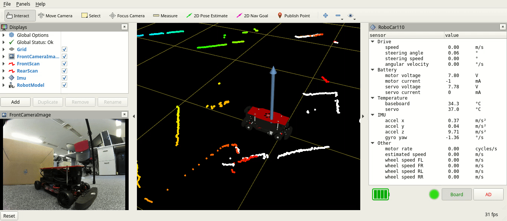

# RoboCar 1/10 ROS

[](https://www.zmp.co.jp/en/products/robocar/robocar-110x)

ROS nodes for RoboCar 1/10 are divided to multiple groups:

| Group                                              | Description                   |
|:------------------                                 |:------------------------      |
| [**rc110_core**](rc110_core/README.md)             | Major Nodes                   |
| [**rc110_external**](rc110_external/README.md)     | External ROS Nodes            |
| [**rc110_monitoring**](rc110_monitoring/README.md) | Remote Monitoring and Control |
| [**rc110_navigation**](rc110_navigation/README.md) | SLAM and Navigation           |
| [**rc110_perception**](rc110_perception/README.md) | Perception                    |
| [**rc110_simulation**](rc110_simulation/README.md) | Simulation                    |
| [**rc110_utils**](rc110_utils/README.md)           | Utilities                     |

* Core group includes robot manipulation and sensor values retrieval.
    - It is installed and running by default on the robot.
	- It tends to have more support than other groups.
* Any node can be customized. 
    - For a completely different node, please, create and use a separate git repo on the same folder level as **robocar110_ros**.
	- For small improvements and bugfixes, it's better to modify **robocar110_ros** ([**Contribution Rules**](docs/Contribution.md))

## Prerequisites

#### RC110 Source Code
```
mkdir -p ~/ros/src
cd ~/ros/src
git clone https://github.com/zmp/robocar110_ros.git
```
```
cd ~/ros/src/robocar110_ros/  # make commands below are called from here!
```

* It's possible to use other directory (for example `~/robocar110_ros/`), but it's not ROS standard way, so we don't provide support for it. Do it on your own risk.

#### ROS
If ROS is not installed, please, install it following the instruction for **melodic**:

http://wiki.ros.org/Installation/Ubuntu

Alternatively you can use the following command, but we cannot guarantee it will always work.
```
make ros-install
```

#### ROS Environment
```
make ros-source
```

* Optional.
* It will place ros sourcing to `~/.bashrc`.
* You need to restart terminal after that.

## Build on Robot

* Mandatory: 
    * [**core packages**](rc110_core/README.md#Build) 
* Optional:
    * [**rc110_behavior**](rc110_navigation/rc110_behavior/README.md)
    * [**rc110_slam_he**](rc110_navigation/rc110_slam_he/README.md)
    * etc...



## Build for Simulation

Without robot, there's no need to build driver and system service packages, thus it's ok to skip **core packages** above.

After installing ROS, proceed to 
* [**rc110_gazebo**](rc110_simulation/rc110_gazebo/README.md)

## Build All
```
make init  # to prepare rosdep
rosdep install -iry --from-paths .
```

* Then install manually dependencies that rosdep does not support.
* And run the build:
```
catkin config --blacklist rc110_video_server rc110_object_detection
catkin build -DCATKIN_ENABLE_TESTING=OFF
```
or
```
catkin_make -DCATKIN_BLACKLIST_PACKAGES="rc110_video_server;rc110_object_detection" -DCATKIN_ENABLE_TESTING=OFF
```

* Please, change blacklisted packages according to your needs.

## ~ Additional ~

* [**Windows**](docs/Windows.md)
* [**Contribution Rules**](docs/Contribution.md)
* [**Make Commands Explanation**](docs/Makefiles.md)
