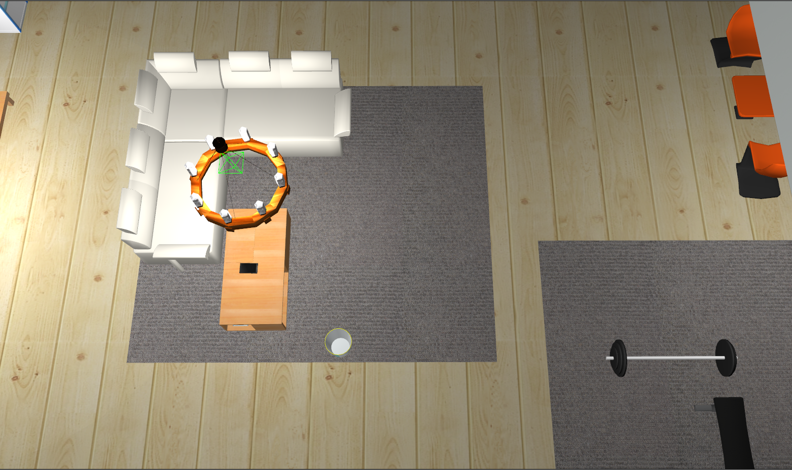

**Annotations**  
For clarity of explanation, the procedure for using https://github.com/aws-robotics/aws-robomaker-small-house-world is written.    
Open a terminal and use git clone to download the data for the map you want to use  
```
git clone https://https://github.com/aws-robotics/aws-robomaker-small-house-world.git
```  

After stopping the robot car, type the following command to run gazebo and check if the map is reflected.
```
cd aws-robomaker-small-house-world
export GAZEBO_MODEL_PATH=`pwd`/models
gazebo worlds/small_house.world --verbose
```  
If the reflection was successful, you will see an image like this.  
[]  

After confirmation, stop the operation and make the following changes to `/home/zmp/ros/src/robocar110_ros/rc110_simulation/rc110_gazebo/launch/main.launch`.
```
<arg name="world" default="/home/zmp/aws-robomaker-small-house-world/worlds/small_house.world"/>
```  
Open a new terminal and type the following command to execute it.
```
cd aws-robomaker-small-house-world
export GAZEBO_MODEL_PATH=`pwd`/models
cd ~/ros/src/robocar110_ros/
make run-gazebo
```  
If the operation is successful, it will look like the following image.  
[]  

If the robot car is not displayed, you can add a model and reflect it in gazebo by doing the following:  
1. Click Insert tab.  
2. Select "Add Path.  
3. Apply `home/zmp/ros/src/robocar110_ros/rc110_core/rc110_common/models`.
